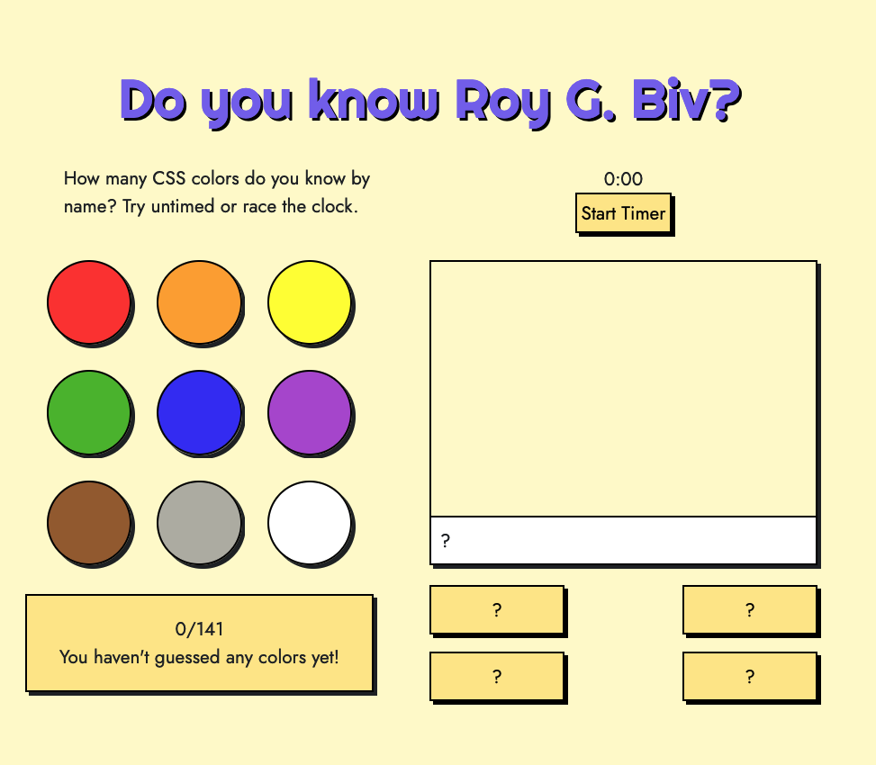

# Do you know Roy G. Biv? 

There are 141 named CSS colors -- how well do you know them?

If you want to test yourself in a timed environment, click start timer. Otherwise, click a category to get started. The paint swatch will display an unidentified color -- guess the name with the buttons below the paint swatch. If you're right, you'll hear a chime and your score will increase. If you're wrong, you'll hear a buzzer and no point. The game ends when you've guessed all 141 colors. 

NOTE: You may be saying, "I heard there were 147 CSS color names!" Well, yes. There are 147 color NAMES but eight have duplicate names -- Aqua/Cyan, Fuschia/Magenta, DarkGrey/DarkGray, Gray/Grey, DimGrey/DimGray, LightSlateGrey/LightSlateGray, SlateGrey/SlateGray, and  DarkSlateGrey/DarkSlateGray. I included both aqua/cyan and fuschia/magenta but not the duplicate grays. 

## Getting Started
https://name-these-colors.netlify.app/

## Screenshots
 

## Technologies Used

Javascript, HTML, CSS

## Next Steps

1. Create mobile design
2. Easy mode - white background
3. Hard mode - hexcodes
4. Add score per category

## Thanks to

All categories come from: https://htmlcolorcodes.com/color-names/

Sounds were found at freesound.org: https://freesound.org/people/chungus43A/sounds/595665/, https://freesound.org/people/philRacoIndie/sounds/551543/, https://freesound.org/people/Rizzard/sounds/558909/, https://freesound.org/people/GreekIrish/sounds/254713/

Damien Bzdyra and Hunter Long for helping debug and untangle my code. 